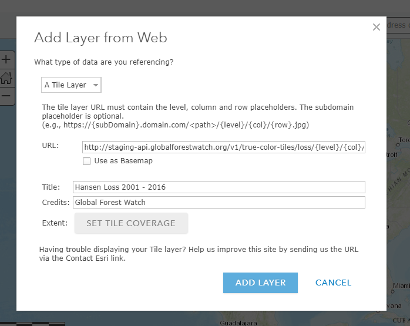
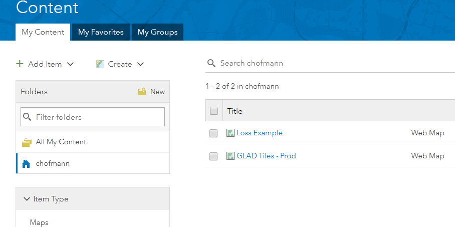
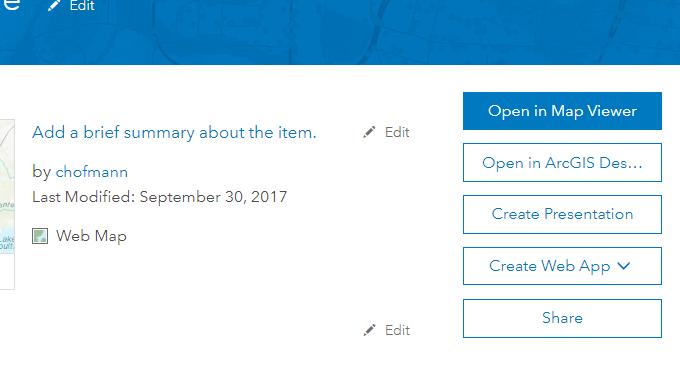
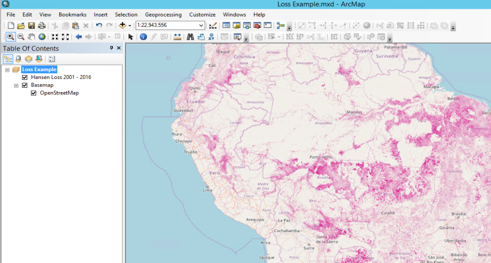

# Adding tiled data to ArcMap


#### Grab your URL

`Loss`:

gfw-data-api: https://tiles.globalforestwatch.org/umd_tree_cover_loss/latest/dynamic/{z}/{x}/{y}

#### Include query parameters if you want to filter the loss data

You can filter the tree cover loss year by year and tree cover density threshold:

Append query parameters to the end of the loss URL like so:

gfw-data-api: `https://tiles.globalforestwatch.org/umd_tree_cover_loss/latest/dynamic/{z}/{x}/{y}?start_year=2001&end_year=2020&tcd=30`

The above (appending ?thresh=30&start_year=2001&end_year=2020 to the loss URL) will return  data from 2001 - 2020 (inclusive) with tree cover density threshold >30, just like on the flagship website. Use of `/latest/` will use the most recent version of the tree cover loss tile cache. 

For more information on the `umd_tree_cover_loss` dynamic tile cache in the API, see https://tiles.globalforestwatch.org/#operation/umd_tree_cover_loss_raster_tile_umd_tree_cover_loss__version__dynamic__z___x___y__png_get.


`GLAD`:

http://production-api.globalforestwatch.org/v1/true-color-tiles/glad/{level}/{col}/{row}


`Tree cover extent 2000`:

There is currently no asset where tree cover density can be queried the way tree cover loss can be but there is a pre-filtered tree cover density asset:
https://tiles.globalforestwatch.org/umd_tree_cover_density_2000/v1.8/tcd_30/{z}/{x}/{y}.png


#### Include query parameters if you want to filter the loss data

You can filer GLAD alerts by date and confirmation status.

Append query parameters to the end of the loss URL like so:
`http://production-api.globalforestwatch.org/v1/true-color-tiles/glad/{level}/{col}/{row}?startDate=2018-01-01&endDate=2018-12-31&showUnconfirmed=false`

This will show confirmed GLAD alerts for the year 2018

#### Add to ArcGIS Online

Click on "Map" on top tab of ArcGis Online.

Go to `Add` --> `Layer From Web`, select `A Tile Layer` from the dropdown and enter one of the URL templates above. For tree cover extent, use the entire URL, including the PNG at the end.




#### Save webmap

Save map, then browse to it (ArcGIS menu  --> `Content`).



#### Download the pkinfo file to view in ArcMap

On the `Content` page, click on the name of the map to download. Then click the `Open in ArcGIS Desktop` link. 
Or on the `Content` page, click on the three dots next to the date, and click on `Open in ArcMap`. 



This should download an item.pkinfo XML file that looks like this:

```xml
<?xml version="1.0" encoding="UTF-8" standalone="no"?>
<pkinfo>
	<ID>3ab9c7bf350744feb5e216032b2edcc5</ID>
	<size>-1</size>
	<created>1506767350000</created>
	<type>Web Map</type>
	<packagelocation>http://www.arcgisonline.com/sharing/content/items/3ab9c7bf350744feb5e216032b2edcc5/data</packagelocation>
	<pkinfolocation>http://www.arcgisonline.com/sharing/content/items/3ab9c7bf350744feb5e216032b2edcc5/item.pkinfo</pkinfolocation>
</pkinfo>
```

#### Double click the .pkinfo file to open in ArcMap



#### Notes

Given the WGS84 --> Web Mercator projection, these tiles are not recommended for zoom levels > than 12. In short, if you need to see individual pixels, use the Hansen tiles themselves.

I've updated the microservice to scale tiles, so you should be able to see pixels at high zoom levels (> 12) in any client. Let me know if this isn't the case.

#### Future development

Happy to add Terra I to this as well, and to add date filtering to GLAD as well. Let me know if this is of interest.
